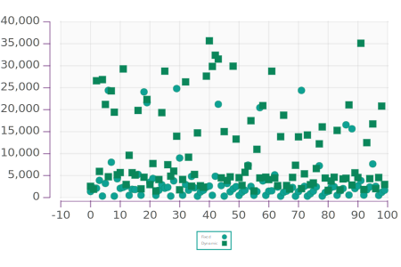
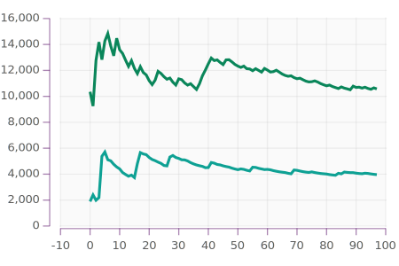

[quilt](https://github.com/tonyday567/quilt) [](https://travis-ci.org/tonyday567/quilt)
==================================================================================================================================================================

This is where and how I go about a haskell library refactor. I pick a
new ghc version, and a new stack lts, and set this project up with no
compile warts. Each addition adds a constellation of libraries I use,
and a logic compilation milepegs.

[readme-lhs](https://github.com/tonyday567/readme-lhs)
------------------------------------------------------

This is a thin wrap around protolude and pandoc, containing much loved
functionality. This sets Text as a major primitive type.

``` {.output .example}
Simple example of an output
```

[numhask-space](https://github.com/tonyday567/numhask-space)
------------------------------------------------------------

Some concrete geometry.

``` {.output .NumHask.Space}
[0.0,4.0,8.0,12.0,16.0,20.0,24.0,28.0,32.0,36.0,40.0,44.0,48.0,52.0,56.0,60.0,64.0]
```

[numhask-array](https://github.com/tonyday567/numhask-array)
------------------------------------------------------------

n-dimensional arrays

``` {.output .NumHask.Array}
[[14.0, 32.0],
 [32.0, 77.0]]
```

[box](https://github.com/tonyday567/box)
----------------------------------------

A profunctor with STM queues at each end.

echo: hi

echo: bye

[web-rep](https://github.com/tonyday567/web-rep)
------------------------------------------------

Representations of web pages.

``` {.output .web-rep}
<!DOCTYPE HTML><html lang="en"><head><meta charset="utf-8"></head><body><script>window.onload=function(){}</script></body></html>
```

[chart-svg](https://github.com/tonyday567/chart-svg)
----------------------------------------------------

Numerical charts in svg.


[perf](https://github.com/tonyday567/perf)
------------------------------------------

low-level performance stats



Inner array loop for numhask-array.

| run                 |     100|        |        |        |        |        |        |        |        |        |        |        |        |        |        |        |        |        |        |        |        |        |        |        |        |        |        |        |        |        |        |        |        |        |        |        |        |        |        |        |        |        |        |        |        |        |        |        |        |        |        |        |        |        |        |        |        |        |        |        |        |        |        |        |        |        |        |        |        |        |        |        |        |        |        |        |        |        |        |        |        |        |        |        |        |        |        |        |        |        |        |        |        |        |        |        |        |        |        |        |
|:--------------------|-------:|--------|--------|--------|--------|--------|--------|--------|--------|--------|--------|--------|--------|--------|--------|--------|--------|--------|--------|--------|--------|--------|--------|--------|--------|--------|--------|--------|--------|--------|--------|--------|--------|--------|--------|--------|--------|--------|--------|--------|--------|--------|--------|--------|--------|--------|--------|--------|--------|--------|--------|--------|--------|--------|--------|--------|--------|--------|--------|--------|--------|--------|--------|--------|--------|--------|--------|--------|--------|--------|--------|--------|--------|--------|--------|--------|--------|--------|--------|--------|--------|--------|--------|--------|--------|--------|--------|--------|--------|--------|--------|--------|--------|--------|--------|--------|--------|--------|--------|--------|
| NumHask.Array.Fixed |  1.02e7| 2.33e6 | 8.25e6 | 1.64e6 | 2.92e6 | 2.35e6 | 8.18e6 | 1.51e6 | 1.43e6 | 2.52e6 | 2.09e6 | 8.16e6 | 1.28e6 | 2.56e6 | 2.87e6 | 7.77e6 | 1.20e6 | 2.46e6 | 2.92e6 | 8.58e6 | 1.07e6 | 2.34e6 | 2.81e6 | 8.71e6 | 9.41e5 | 2.25e6 | 8.35e6 | 2.03e6 | 1.75e6 | 2.02e6 | 2.61e6 | 8.43e6 | 1.81e6 | 2.04e6 | 8.13e6 | 1.78e6 | 1.65e6 | 2.88e6 | 8.02e6 | 1.66e6 | 1.54e6 | 1.46e6 | 2.59e6 | 2.00e6 | 8.23e6 | 1.44e6 | 2.69e6 | 2.04e6 | 8.02e6 | 1.29e6 | 2.61e6 | 8.70e6 | 1.27e6 | 1.12e6 | 2.46e6 | 8.63e6 | 2.11e6 | 9.08e5 | 2.31e6 | 2.83e6 | 8.66e6 | 1.02e6 | 2.21e6 | 8.32e6 | 2.04e6 | 1.78e6 | 2.06e6 | 2.57e6 | 8.43e6 | 1.81e6 | 1.57e6 | 1.75e6 | 2.32e6 | 8.50e6 | 1.65e6 | 1.84e6 | 2.21e6 | 8.12e6 | 1.54e6 | 2.71e6 | 7.99e6 | 1.53e6 | 1.39e6 | 2.70e6 | 3.01e6 | 7.74e6 | 1.28e6 | 2.61e6 | 8.73e6 | 1.39e6 | 1.13e6 | 2.40e6 | 2.95e6 | 8.64e6 | 1.00e6 | 2.43e6 | 2.82e6 | 8.16e6 | 1.89e6 | 7.35e5 |

[online](https://github.com/tonyday567/online)
----------------------------------------------

rolling statistics



[online-market](https://github.com/tonyday567/online-market/blob/master/runs/default/index.html)
------------------------------------------------------------------------------------------------

workflow
--------

    stack build --test --exec "$(stack path --local-install-root)/bin/quilt" --file-watch
