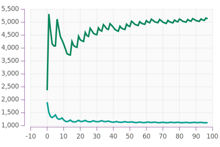

+++
date = "2020-03-09"
title = "A haskell quilt"
+++

[quilt](https://github.com/tonyday567/quilt) [](https://travis-ci.org/tonyday567/quilt)
==================================================================================================================================================

> True greatness is measured by how much freedom you give to others, not
> by how much you can coerce others to do what you want. \~ Larry Wall

This is a patchwork quilt of all my favorite libraries I like to keep up
to date with ghc.

[numhask-prelude](https://hackage.haskell.org/package/numhask-prelude)
----------------------------------------------------------------------

There are many preludes, but this one is mine. Choosing a numeric api
using tight classes and wrapping protolude, a minimalist prelude.

This is what you get with the `readme-lhs` stack template.

[readme-lhs](https://github.com/tonyday567/readme-lhs)
------------------------------------------------------

readme-lhs is a wrapper around pandoc that gives me a one-way write
channel into a markdown file.

1.  Add code blocks to markdown files

<!-- -->

        ``` {.output .example}
        ```

1.  Use the runOutput monad.

``` {.haskell}
void $ runOutput ("other/readme_.md", GitHubMarkdown) ("readme.md", GitHubMarkdown) $ do
    output "example" (Fence "Simple example of an output")
```

1.  To produce this:

``` {.output .example}
Simple example of an output
```

1.  Put this in a stack loop like:

<!-- -->

    stack build --test --exec "$(stack path --local-install-root)/bin/quilt" --file-watch

1.  Pipe the written markdown files to upstream processes like blogging
    and logging.

If you code in haskell you really should use the native
[pandoc](https://hackage.haskell.org/package/pandoc) api for text-based
output.

[numhask-space](https://github.com/tonyday567/numhask-space)
------------------------------------------------------------

Provides all sorts of spaces, ranges and grids. The api is general over
a wide range of numbers including times, which can be tricky with
boundary finding. The next 500 days, marked with sensible date
milestones:


[numhask-array](https://github.com/tonyday567/numhask-array)
------------------------------------------------------------

numhask-array is an n-dimensional array library I'm extremely proud of,
and love using.

``` {.output .NumHask.Array}
[[14.0, 32.0],
 [32.0, 77.0]]
```

[box](https://github.com/tonyday567/box)
----------------------------------------

A profunctor with queues at each end.

echo: hi

echo: bye

[web-rep](https://github.com/tonyday567/web-rep)
------------------------------------------------

This brings in lens, javascript, clay, lucid and scotty, and provides
representations of web pages.

``` {.output .web-rep}
<!DOCTYPE HTML><html lang="en"><head><meta charset="utf-8"></head><body><script>window.onload=function(){}</script></body></html>
```

[chart-svg](https://github.com/tonyday567/chart-svg)
----------------------------------------------------

Numerical charts targetting svg as the backend.


[perf](https://github.com/tonyday567/perf)
------------------------------------------

low-level performance stats


Inner array loop for numhask-array.

| run                 |     100|        |        |        |        |        |        |        |        |        |        |        |        |        |        |        |        |        |        |        |        |        |        |        |        |        |        |        |        |        |        |        |        |        |        |        |        |        |        |        |        |        |        |        |        |        |        |        |        |        |        |        |        |        |        |        |        |        |        |        |        |        |        |        |        |        |        |        |        |        |        |        |        |        |        |        |        |        |        |        |        |        |        |        |        |        |        |        |        |        |        |        |        |        |        |        |        |        |        |        |
|:--------------------|-------:|--------|--------|--------|--------|--------|--------|--------|--------|--------|--------|--------|--------|--------|--------|--------|--------|--------|--------|--------|--------|--------|--------|--------|--------|--------|--------|--------|--------|--------|--------|--------|--------|--------|--------|--------|--------|--------|--------|--------|--------|--------|--------|--------|--------|--------|--------|--------|--------|--------|--------|--------|--------|--------|--------|--------|--------|--------|--------|--------|--------|--------|--------|--------|--------|--------|--------|--------|--------|--------|--------|--------|--------|--------|--------|--------|--------|--------|--------|--------|--------|--------|--------|--------|--------|--------|--------|--------|--------|--------|--------|--------|--------|--------|--------|--------|--------|--------|--------|--------|
| NumHask.Array.Fixed |  1.01e7| 7.71e6 | 1.81e6 | 1.61e6 | 1.58e6 | 1.70e6 | 2.18e6 | 1.50e6 | 1.44e6 | 2.64e6 | 7.50e6 | 1.41e6 | 1.34e6 | 2.62e6 | 2.88e6 | 7.36e6 | 1.21e6 | 2.57e6 | 2.89e6 | 7.36e6 | 1.13e6 | 2.41e6 | 8.17e6 | 2.11e6 | 9.17e5 | 2.33e6 | 2.79e6 | 8.14e6 | 1.79e6 | 2.09e6 | 7.92e6 | 2.11e6 | 2.02e6 | 2.59e6 | 8.55e6 | 3.67e6 | 1.86e6 | 1.61e6 | 1.82e6 | 2.28e6 | 8.06e6 | 1.61e6 | 2.70e6 | 2.08e6 | 7.60e6 | 1.47e6 | 2.78e6 | 7.70e6 | 1.43e6 | 1.30e6 | 2.74e6 | 8.32e6 | 1.28e6 | 1.21e6 | 2.55e6 | 3.01e6 | 8.22e6 | 9.81e5 | 2.39e6 | 8.11e6 | 2.17e6 | 1.01e6 | 2.29e6 | 2.76e6 | 8.42e6 | 1.90e6 | 7.54e5 | 2.05e6 | 2.57e6 | 8.30e6 | 1.25e6 | 1.84e6 | 2.41e6 | 7.89e6 | 1.67e6 | 1.93e6 | 7.85e6 | 1.65e6 | 1.58e6 | 2.77e6 | 2.20e6 | 7.65e6 | 1.48e6 | 2.77e6 | 7.50e6 | 1.36e6 | 1.29e6 | 2.64e6 | 3.13e6 | 7.56e6 | 1.27e6 | 2.56e6 | 3.03e6 | 8.28e6 | 1.05e6 | 1.04e6 | 2.27e6 | 2.84e6 | 7.64e6 | 9.12e5 |

[online](https://github.com/tonyday567/online)
----------------------------------------------

rolling statistics



[online-market](https://github.com/tonyday567/online-market/blob/master/runs/default/index.html)
------------------------------------------------------------------------------------------------

global installs
---------------

-   hoogle
-   hie
-   hie-wrapper
-   hlint
-   weeder
-   ormolu
-   ghcid
-   haddock
-   pandoc

workflow
--------

    stack build --test --exec "$(stack path --local-install-root)/bin/quilt" --file-watch
