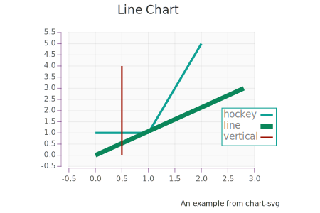

[quilt](https://github.com/tonyday567/quilt) [](https://travis-ci.org/tonyday567/quilt)
==================================================================================================================================================

> True greatness is measured by how much freedom you give to others, not
> by how much you can coerce others to do what you want. \~ Larry Wall

ghc-8.10.1 nightly-2020-06-25

OSX Install.

    brew install haskell-stack
    stack new simple readme-lhs
    cd quilt
    stack build --test --exec "$(stack path --local-install-root)/bin/quilt" --file-watch

[numhask-prelude](https://hackage.haskell.org/package/numhask-prelude)
----------------------------------------------------------------------

`numhask-prelude` brings in core libraries, and sets up numeric and Text
channels.

This is also what you get with the
[readme-lhs](https://github.com/tonyday567/readme-lhs/blob/master/other/readme-lhs.hsfiles)
stack template.

[readme-lhs](https://github.com/tonyday567/readme-lhs)
------------------------------------------------------

readme-lhs is a wrapper around pandoc that gives me a one-way write
channel into a markdown file.

-   Add code blocks to markdown files that looks something like this:

          ``` {.output .example}
          ```

-   Use Readme.Lhs.runOutput to insert output, like this:

``` {.haskell}
void $ runOutput ("other/readme_.md", GitHubMarkdown) ("readme.md", GitHubMarkdown) $ do
    output "example" (Fence "Simple example of an output")
```

-   And produce this:

``` {.output .example}
Simple example of an output
```

-   Put this in a stack loop like this:

<!-- -->

    stack build --exec "$(stack path --local-install-root)/bin/quilt" --file-watch

-   Pipe the markdown file somewhere to render it, and you have a very
    tight workflow.

-   Use Pandoc Native

    -   If you code in haskell use the native
        [pandoc](https://hackage.haskell.org/package/pandoc) api for
        output, and if you can't convert, it shouldn't exist.

[numhask-space](https://github.com/tonyday567/numhask-space)
------------------------------------------------------------

Provides all sorts of spaces, ranges and grids. The api is general over
a wide range of numbers including times, which can be tricky with
boundary finding. The next 500 days, marked with sensible date
milestones:


[numhask-array](https://github.com/tonyday567/numhask-array)
------------------------------------------------------------

numhask-array is an n-dimensional array library I'm extremely proud of.
Matrix multiplication is expressed like so:

    let b :: Array '[2, 3] Double = fromList [1 .. 6]
    dot sum (*) b (F.transpose b)

``` {.output .NumHask.Array}
[[14.0, 32.0],
 [32.0, 77.0]]
```

It is rare to see matrix multiplication abstracted in this way, with an
exposed binary operator and then an exposed fold operation. APL comes to
mind but none of the numeric inclined fashions.

And when, in haskell, you can make something like this polymorphic, ghc
can work miracles behind the scenes. This next example looks for vector
matches within a matrix

    -- >>> let cs = fromList ("abacbaab" :: [Char]) :: Array '[4,2] Char
    -- >>> let v = fromList ("ab" :: [Char]) :: Vector 2 Char
    -- >>> dot (all id) (==) cs v
    -- [True, False, False, True]

[box](https://github.com/tonyday567/box)
----------------------------------------

A profunctor with queues at each end.

echo: hiecho: bye

[web-rep](https://github.com/tonyday567/web-rep)
------------------------------------------------

This brings in lens, javascript, clay, lucid and scotty, and provides
representations of web pages.

``` {.output .web-rep}
<!DOCTYPE HTML><html lang="en"><head><meta charset="utf-8"></head><body><script>window.onload=function(){}</script></body></html>
```

[chart-svg](https://github.com/tonyday567/chart-svg)
----------------------------------------------------

Numerical charts targetting svg as the backend.



[perf](https://github.com/tonyday567/perf)
------------------------------------------

low-level performance stats


[online](https://github.com/tonyday567/online)
----------------------------------------------

statistics based on mealy machines


development
===========

    stack build --exec "$(stack path --local-install-root)/bin/quilt" --file-watch

toolkit
-------

I run spacemacs with a few variables tweaked:

    (haskell
     :variables
     haskell-completion-backend 'lsp
     haskell-process-suggest-remove-import-lines nil
     lsp-haskell-process-path-hie "haskell-language-server"
    )

`haskell-language-server` works with a local haddock server, so you need
to do `stack haddock --keep-going` to feed it haddocks to render.
Another reason for a patchwork approach.

A hie.yaml is also required.

global installs
---------------

I chisled down my \~/.local/bin to:

-   hoogle
-   haddock
-   hlint
-   ormolu
-   haskell-language-server
-   haskell-language-server-wrapper
-   ghcid
-   pandoc

todo
----

-   backprop
